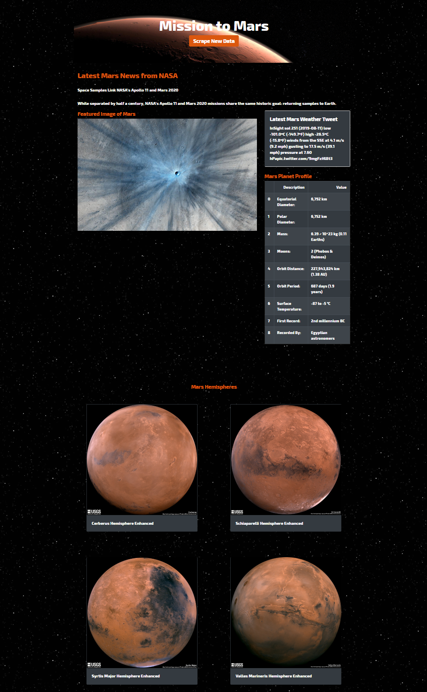

# <h1 align='center'>Web Scraping with Beautiful Soup</h1>




## Web Scraping Objective

Scrape the following websites with Jupyter Notebooks first and then with Flask and MongoDB:
* [NASA Mars News](https://mars.nasa.gov/news/?page=0&per_page=40&order=publish_date+desc%2Ccreated_at+desc&search=&category=19%2C165%2C184%2C204&blank_scope=Latest)
* [JPL Mars Space Images - Featured Image](https://www.jpl.nasa.gov/spaceimages/?search=&category=Mars)
* [Mars Weather](https://twitter.com/marswxreport?lang=en)
* [Mars Facts](https://space-facts.com/mars/)
* [Mars Hemispheres](https://astrogeology.usgs.gov/search/results?q=hemisphere+enhanced&k1=target&v1=Mars)


## Initial Scraping

The initial scraping of five websites was done using:
* Jupyter Notebook 4.4.0
* Python 3.7.4
* pandas 0.25.0
* Beautiful Soup 4.8.0
* Splinter 0.10.0


### [Jupyter Notebook](mission_to_mars.ipynb)


#### Set Up

```python
# import dependencies
import pandas as pd
from bs4 import BeautifulSoup as bs
from splinter import Browser
```

Jupyter Notebook worked better when initializing the browser one time before all scraping and quitting the browser after the final scrape.

```python
# initialize browser
executable_path = {'executable_path': '../chromedriver'}
browser = Browser('chrome', **executable_path, headless=False)
```

#### NASA Mars News

```python
# scrape latest news article title and headline

# store full url
news_url = 'https://mars.nasa.gov/news/?page=0&per_page=40&order=publish_date+desc%2Ccreated_at+desc&search=&category=19%2C165%2C184%2C204&blank_scope=Latest'

# visit mars news website
browser.visit(news_url)

# parse through html
news_soup = bs(browser.html, 'html.parser')

# store title and headline
news_title = news_soup.find_all('div', class_='content_title')[0].text
news_p = news_soup.find_all('div', class_='article_teaser_body')[0].text

# print title and headline
print(news_title)
print(news_p)
```


#### JPL Mars Space Images - Featured Image

```python
# scrape featured_image_url

# store full and base urls
image_url = 'https://www.jpl.nasa.gov/spaceimages/?search=&category=Mars'
image_base_url = 'https://www.jpl.nasa.gov'

# visit site
browser.visit(image_url)

# click on 'full image' to open the image in full
browser.click_link_by_partial_text('FULL IMAGE')

# parse through html
image_soup = bs(browser.html, 'html.parser')

# store partial url
img = image_soup.find('img', class_='fancybox-image')['src']

# combine base url with partial url
featured_image_url = image_base_url + img

# print url
featured_image_url
```


[Featured Image Url Here](https://www.jpl.nasa.gov/spaceimages/images/mediumsize/PIA19382_ip.jpg)


#### Mars Weather

```python
# scrape latest weather tweet

# store full and base urls
weather_url = 'https://twitter.com/marswxreport?lang=en'

# visit site
browser.visit(weather_url)

# parse through html
weather_soup = bs(browser.html, 'html.parser')

# store latest tweet
latest_weather_tweet = weather_soup.find('p', class_='TweetTextSize').text

# print latest tweet
latest_weather_tweet
```


Latest Mars Weather Tweet: 'InSight sol 250 (2019-08-10) low -100.0ºC (-148.1ºF) high -26.2ºC (-15.1ºF)\nwinds from the SSE at 4.4 m/s (9.8 mph) gusting to 16.2 m/s (36.2 mph)\npressure at 7.60 hPapic.twitter.com/9sZRRUi3dm'


#### Mars Facts

```python
# scrape table with facts about mars

# store full url
facts_url = 'https://space-facts.com/mars/'

# reading html into a dataframe
facts_table = pd.read_html(facts_url)

# store only mars facts
mars_table = facts_table[1]

# renaming columns
facts_mapping = {0:'Specifications', 1:'Measurements'}
mars_table = mars_table.rename(columns=facts_mapping)

# saving as html table format
mars_table.to_html('mars_table.html', index=False)

# print data frame
print(mars_table)
```


#### Mars Hemispheres

```python
# scrape hemisphere images

# store full and base urls
astro_url = 'https://astrogeology.usgs.gov/search/results?q=hemisphere+enhanced&k1=target&v1=Mars'
astro_base_url = "https://astrogeology.usgs.gov"

# visit hemispheres website
browser.visit(astro_url)
astro_soup = bs(browser.html, 'html.parser')

# creating empty lists to append scraped data
hemi_image_list = []
title_list = []
url_list = []

# loop through links and avoid two links that are the same
div_list = astro_soup.find_all('a', class_='itemLink')
for link in div_list:
    image_url = link.get('href')
    if image_url not in hemi_image_list:
        hemi_image_list.append(image_url)
        browser.visit(astro_base_url + image_url)
        title_list.append(browser.find_by_tag('h2').text)
        browser.find_link_by_text('Sample').click()
        
for i in range(4,0,-1):
    url_list.append(browser.windows[i].url)
    
# close browser
browser.quit()

# create list of hemisphere titles and hemisphere urls in dictionaries
featured_hemisphere_list = [{'title': title_list[0], 'img_url': url_list[0]},
                            {'title': title_list[1], 'img_url': url_list[1]},
                            {'title': title_list[2], 'img_url': url_list[2]},
                            {'title': title_list[3], 'img_url': url_list[3]}]
featured_hemisphere_list
```
Featured Hemisphere List: [{'title': 'Cerberus Hemisphere Enhanced', 'img_url': 'https://astropedia.astrogeology.usgs.gov/download/Mars/Viking/cerberus_enhanced.tif/full.jpg'}, {'title': 'Schiaparelli Hemisphere Enhanced', 'img_url': 'https://astropedia.astrogeology.usgs.gov/download/Mars/Viking/schiaparelli_enhanced.tif/full.jpg'}, {'title': 'Syrtis Major Hemisphere Enhanced', 'img_url': 'https://astropedia.astrogeology.usgs.gov/download/Mars/Viking/syrtis_major_enhanced.tif/full.jpg'}, {'title': 'Valles Marineris Hemisphere Enhanced', 'img_url': 'https://astropedia.astrogeology.usgs.gov/download/Mars/Viking/valles_marineris_enhanced.tif/full.jpg'}]


## Python Scraping with Flask and MongoDB

Next, scraping of the same five websites was done with a Python file and the following:
* pandas
* Beautiful Soup
* Splinter
* Redirect
* Flask
* PyMongo


### [Scrape Mars Routes](scrape_mars.py)

The following steps were taken to create six routes:

#### Set Up

```python
# import dependencies
import pandas as pd 
from bs4 import BeautifulSoup as bs
from splinter import Browser
import requests 

executable_path = {'executable_path': '../chromedriver'}
browser = Browser('chrome', **executable_path, headless=False)
```


#### Main Scrape Route

```python
def scrape():
    news_title, news_p = scrape_mars_nasa_news()
    
    mars_info = {
        "news_title": news_title,
        "news_p": news_p,
        "image": scrape_mars_featured_image(),
        "weather": scrape_mars_weather_tweet(),
        "facts": scrape_mars_facts_table(),
        "hemispheres": scrape_mars_hemispheres()
    }
    
    # close browser
    browser.quit()

    # put all info into dictionary
    return mars_info
```
    
#### NASA Mars News

```python
def scrape_mars_nasa_news():
        # store full url
        news_url = 'https://mars.nasa.gov/news/?page=0&per_page=40&order=publish_date+desc%2Ccreated_at+desc&search=&category=19%2C165%2C184%2C204&blank_scope=Latest'

        # visit site
        browser.visit(news_url)

        # scrape page into soup
        news_soup = bs(browser.html, 'html.parser')

        # store title and headline
        news_title = news_soup.find_all('div', class_='content_title')[0].text
        news_p = news_soup.find_all('div', class_='article_teaser_body')[0].text

        # return results
        return news_title, news_p
```


#### JPL Mars Space Images - Featured Image

```python
def scrape_mars_featured_image():
        # store full and base urls
        image_url = 'https://www.jpl.nasa.gov/spaceimages/?search=&category=Mars'
        image_base_url = 'https://www.jpl.nasa.gov'

        # visit site
        browser.visit(image_url)

        # parse through html
        image_soup = bs(browser.html, 'html.parser')

        # previous attempt to click FULL IMAGE was having hiccups so tried to parse through style content
        partial_image_url  = image_soup.find('article')['style'].replace('background-image: url(','').replace(');', '')[1:-1]

        # combine base url with partial url
        featured_image_url = image_base_url + partial_image_url

        # return results
        return featured_image_url
```


#### Mars Weather

```python
def scrape_mars_weather_tweet():
        # store full and base urls
        weather_url = 'https://twitter.com/marswxreport?lang=en'

        # visit site
        browser.visit(weather_url)

        # scrape page into soup
        weather_soup = bs(browser.html, 'html.parser')

        # store latest tweet
        latest_weather_tweet = weather_soup.find('p', class_='TweetTextSize').text

        # return results
        return latest_weather_tweet
```


#### Mars Facts

```python
def scrape_mars_facts_table():
    # store full url
    facts_url = 'https://space-facts.com/mars/'

    # reading html into a dataframe
    facts_table = pd.read_html(facts_url, attrs = {'id': 'tablepress-p-mars'})
    facts_df = pd.concat(facts_table)

#     # renaming columns
    facts_mapping = {0:'Description', 1:'Value'}
    mars_table = facts_df.rename(columns=facts_mapping)

    # return results
    return mars_table.to_html(classes="table table-striped table-dark")
```


#### Mars Hemispheres

```python
def scrape_mars_hemispheres():        
        # store full and base urls
        astro_url = 'https://astrogeology.usgs.gov/search/results?q=hemisphere+enhanced&k1=target&v1=Mars'
        astro_base_url = "https://astrogeology.usgs.gov"

        # visit url
        browser.visit(astro_url)
        astro_soup = bs(browser.html, 'html.parser')

        # creating empty lists to append scraped data
        hemi_image_list = []
        title_list = []
        url_list = []

        # loop through links and avoid two links that are the same
        div_list = astro_soup.find_all('a', class_='itemLink')
        for link in div_list:
            image_url = link.get('href')
            if image_url not in hemi_image_list:
                hemi_image_list.append(image_url)
                browser.visit(astro_base_url + image_url)
                title_list.append(browser.find_by_tag('h2').text)
                browser.find_link_by_text('Sample').click()
                
        for i in range(4,0,-1):
            url_list.append(browser.windows[i].url)
            
        # create list of hemisphere titles and hemisphere urls in dictionaries
        featured_hemisphere_list = [
            {'title': title_list[0], 'img_url': url_list[0]},
            {'title': title_list[1], 'img_url': url_list[1]},
            {'title': title_list[2], 'img_url': url_list[2]},
            {'title': title_list[3], 'img_url': url_list[3]}
            ]

        # close browser
        browser.quit()

        # return results
        return featured_hemisphere_list
```

### [App.py File](app.py)

The app.py file has the root and the scrape page routes after importing 'scrape_mars' from above.

```python
############################## SET UP ##############################
# dependencies
from flask import Flask, render_template, redirect
import pymongo
import scrape_mars

# initialize flask
app = Flask(__name__)

# remember to start server before executing
client = pymongo.MongoClient('mongodb://localhost:27017/')

############################## ROUTES ##############################
# default route that renders index.html template
@app.route("/")
def index():
    # find data 
    mars = client.db.mars.find_one()
    # return template
    return render_template("index.html", mars=mars)

# scrape route
@app.route("/scrape")
def scrape():
    mars = client.db.mars
    mars_scraping = scrape_mars.scrape()
    mars.update({}, mars_scraping, upsert=True)
    return redirect("/", code=302)

if __name__ == "__main__":
    app.run(debug=True)
```